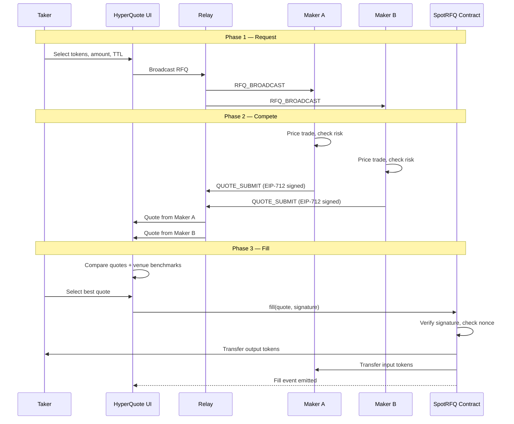

# How RFQ Works

Request-for-Quote (RFQ) is a trading model where a taker broadcasts a structured intent to trade, competing makers respond with binding price quotes, and the taker selects the best quote for atomic on-chain execution. This page explains the RFQ lifecycle at a conceptual level.

import { Callout } from 'nextra/components'

## What is an RFQ?

An RFQ (Request-for-Quote) is a message that says: "I want to trade X amount of token A for token B. What price will you give me?"

Unlike placing an order on an exchange, an RFQ does not commit the taker to a price upfront. Instead, it invites liquidity providers to compete for the trade by submitting firm quotes. The taker then selects the best offer and executes it.

This model is the dominant execution mechanism in traditional finance for large trades in FX, fixed income, and structured products. HyperQuote brings the same model to DeFi on HyperEVM.

## RFQ vs Limit Orders vs AMM Swaps

### Limit Orders (CLOB)

With a limit order, you post a bid or offer at a specific price on an order book and wait for a counterparty to match against it. The problem for large trades is that your order is **visible to the market** before it fills. Other participants can front-run your order, pull their liquidity, or adjust prices in response to your resting order.

### AMM Swaps

With an AMM swap, you trade against a liquidity pool governed by a mathematical bonding curve (e.g., constant product). The pool always provides a price, but that price **degrades with size**. A $100 swap might get a tight spread, but a $100,000 swap on the same pool could suffer significant price impact. AMM swaps are also susceptible to sandwich attacks, where MEV bots detect your pending transaction and profit by trading around it.

### RFQ

With RFQ, you broadcast your intent **privately** to a set of makers. Each maker sees the exact size of the trade and can tailor their quote accordingly. The winning quote is signed off-chain and settled atomically on-chain, leaving no window for front-running or sandwich attacks.

| Property | Limit Order | AMM Swap | RFQ |
|----------|------------|----------|-----|
| Price discovery | Passive (resting orders) | Algorithmic (bonding curve) | Active (maker competition) |
| Size awareness | No (fills against resting depth) | No (price impact scales with size) | Yes (makers quote for exact size) |
| MEV exposure | Moderate (visible in mempool) | High (sandwich attacks) | None (off-chain quote, atomic fill) |
| Execution certainty | Uncertain (depends on fills) | High (always available) | High (firm signed quotes) |
| Best for | Small–medium orders | Small swaps, long-tail tokens | Large trades, institutional size |

## The Request-Compete-Fill Lifecycle

HyperQuote RFQ execution follows a three-phase lifecycle. The diagram below shows the end-to-end flow from taker request through maker competition to atomic on-chain settlement.

### Phase 1: Request

The taker opens the HyperQuote UI and specifies the trade parameters:

- **Token pair** — Which token they want to sell and which they want to receive
- **Size** — The exact amount they want to trade
- **For options** — Strike price, expiry date, and option type (call or put)

The taker submits this as an RFQ, which is sent to the HyperQuote relay server. The relay validates the request parameters and broadcasts it to all connected makers via WebSocket.

<Callout type="info">
The RFQ itself does not commit the taker to any price. It is a request, not an order. The taker can reject all quotes if none are satisfactory.
</Callout>

### Phase 2: Compete

Makers receive the RFQ broadcast and decide whether to respond. Each maker independently:

1. **Evaluates the trade** — Checks the token pair, size, and direction against their inventory, risk limits, and market view.
2. **Prices the quote** — Determines the amount they are willing to pay or receive, factoring in the specific trade size.
3. **Signs the quote** — Creates an EIP-712 typed data signature binding their address to the exact trade parameters (token addresses, amounts, deadline, nonce).
4. **Submits the quote** — Sends the signed quote back to the relay, which forwards it to the taker.

Multiple makers may quote on the same RFQ, creating a competitive auction. Quotes include a deadline after which they expire automatically.

### Phase 3: Fill

The taker reviews all received quotes. The HyperQuote UI also fetches comparison prices from HyperCore and HyperEVM DEXes so the taker can verify the RFQ price is competitive.

When the taker selects a quote:

1. The taker's wallet submits the maker's signed quote to the on-chain settlement contract.
2. The contract verifies the EIP-712 signature, confirming the maker authorized the exact parameters.
3. The contract checks the nonce to prevent replay attacks.
4. The contract atomically executes the token transfers — the taker's tokens move to the maker, and the maker's tokens move to the taker, in a single transaction.

If any validation check fails (invalid signature, expired deadline, used nonce, insufficient balance), the entire transaction reverts. Nothing transfers.

## Role of the Relay

The relay is a lightweight WebSocket server that routes messages between takers and makers. It performs several functions:

- **Broadcasts RFQs** to all connected makers so they can compete on every trade
- **Validates message format** to ensure RFQs and quotes have correct parameters before forwarding
- **Verifies signatures** on submitted quotes to reject malformed or tampered messages early
- **Enforces rate limits** to prevent spam and abuse
- **Manages RFQ lifecycle** with time-to-live (TTL) expiration on active requests

<Callout type="warning">
The relay is a coordination layer only. It never holds user funds, cannot execute trades, and cannot alter signed quotes. All settlement authority resides in the on-chain smart contracts.
</Callout>

## Role of On-Chain Settlement

The smart contracts on HyperEVM are the ultimate source of truth. They:

- **Verify cryptographic signatures** — Only quotes signed by the maker's private key are accepted
- **Enforce replay protection** — Each quote has a nonce that must meet or exceed the maker's current on-chain nonce
- **Execute atomic transfers** — Both sides of the trade are transferred in a single transaction, eliminating counterparty risk
- **Handle collateral** — For options, the contract locks the seller's collateral and manages physical settlement at expiry
- **Emit transparent events** — Every trade is logged on-chain for auditability

## Why RFQ is Suited to Large Trades

The core advantage of RFQ for large trades comes down to **information asymmetry control**:

1. **No price impact** — The maker quotes a fixed price for the entire size. There is no bonding curve pushing the price against you as size increases.

2. **No information leakage** — Your trade intent is sent to a known set of makers, not broadcast to a public mempool. Makers are economically incentivized to fill your order, not to front-run it.

3. **Competitive tension** — Multiple makers competing on the same RFQ creates a natural auction that drives prices toward fair value. The more makers connected, the tighter the spreads.

4. **Execution certainty** — Once you select a quote, the on-chain transaction either fills completely or reverts completely. There is no partial fill risk.

For these reasons, RFQ consistently delivers better execution on trades above a few thousand dollars compared to AMM swaps on the same token pairs.

## Next Steps

- [Architecture Overview](/introduction/architecture-overview) — See the technical components that power the RFQ lifecycle
- [Requesting a Quote](/trading/requesting-a-quote) — Step-by-step guide to placing your first RFQ
- [Maker Overview](/makers/maker-overview) — Learn how to participate as a liquidity provider
