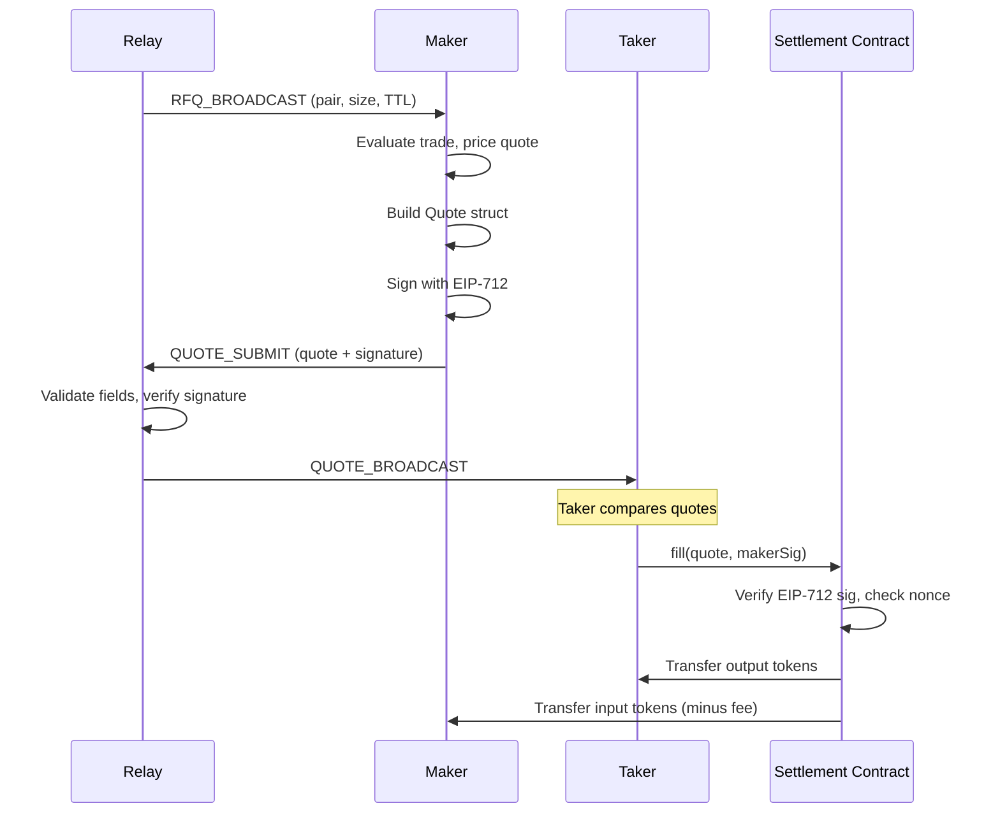

# Submitting Quotes

import { Callout } from 'nextra/components'

After receiving an `RFQ_BROADCAST`, evaluating the opportunity, and computing a price, the maker constructs and submits a signed quote back to the relay. This page covers the quote structure, how to build a quote from RFQ parameters, and the submission protocol.

The diagram below shows the end-to-end quote submission flow from receiving an RFQ broadcast to the taker executing on-chain.



## Quote Structure

The `Quote` struct mirrors the on-chain `QuoteLib.Quote` in Solidity exactly. Field order and types must match for EIP-712 signature compatibility.

```ts
interface Quote {
  maker: string;        // address -- the maker (quote signer)
  taker: string;        // address -- target taker, or address(0) for open
  underlying: string;   // address -- WHYPE in V1
  collateral: string;   // address -- USDC/USDH/USDT0
  isCall: boolean;      // true = Covered Call, false = Cash-Secured Put
  isMakerSeller: boolean; // V1: must be false
  strike: bigint;       // 1e18 fixed-point USD per underlying
  quantity: bigint;     // underlying base units (10^18 for WHYPE)
  premium: bigint;      // collateral base units (10^cDec)
  expiry: bigint;       // option expiry timestamp (must be 08:00 UTC)
  deadline: bigint;     // quote validity deadline (unix timestamp)
  nonce: bigint;        // maker nonce for replay protection
}
```

<Callout type="warning">
  In V1, `isMakerSeller` must always be `false`. The maker is always the option **buyer** and the taker is always the **seller**. The on-chain contract rejects any quote where `isMakerSeller` is `true`.
</Callout>

## Building a Quote from RFQ Parameters

Most quote fields are derived directly from the incoming RFQ. The maker adds the premium (from their pricing engine), a deadline, and a nonce:

```ts
import { Quote, RFQ } from "@hyperquote/sdk-maker";

function buildQuote(
  rfq: RFQ,
  makerAddress: string,
  premium: bigint,
  deadlineSecs: number,
  nonce: bigint,
): Quote {
  const now = BigInt(Math.floor(Date.now() / 1000));

  return {
    maker: makerAddress,
    taker: "0x0000000000000000000000000000000000000000", // open quote
    underlying: rfq.underlying,
    collateral: rfq.collateral,
    isCall: rfq.isCall,
    isMakerSeller: false,            // V1 requirement
    strike: rfq.strike,              // must match RFQ
    quantity: rfq.quantity,           // must match RFQ
    premium,                         // from pricing engine
    expiry: rfq.expiry,              // must match RFQ
    deadline: now + BigInt(deadlineSecs),
    nonce,
  };
}
```

### Field Matching Rules

The relay enforces strict matching between the quote and the originating RFQ:

| Quote Field | Requirement |
|---|---|
| `underlying` | Must match RFQ `underlying` exactly |
| `collateral` | Must match RFQ `collateral` exactly |
| `isCall` | Must match RFQ `isCall` exactly |
| `strike` | Must match RFQ `strike` exactly |
| `expiry` | Must match RFQ `expiry` exactly |
| `isMakerSeller` | Must be `false` |
| `premium` | Must be > 0 |
| `quantity` | Must be > 0 |
| `deadline` | Must be in the future |

## Quote Deadline

The `deadline` field controls how long the quote remains valid. After the deadline passes, the on-chain contract will reject execution with `QuoteExpired()`.

A typical deadline is 60-120 seconds from now. Shorter deadlines reduce the maker's exposure to stale prices but give the taker less time to execute:

```ts
const QUOTE_DEADLINE_SECS = 120; // 2 minutes
const deadline = BigInt(Math.floor(Date.now() / 1000)) + BigInt(QUOTE_DEADLINE_SECS);
```

## Fee Consideration

<Callout type="info">
  In V1, there is no protocol fee deducted from quotes. The premium the maker quotes is the full amount transferred from buyer to seller on execution. A keeper fee (default 10 bps, max 50 bps) applies only at settlement time, not at trade execution.
</Callout>

## QUOTE_SUBMIT Message Format

Submit the signed quote to the relay using the `QUOTE_SUBMIT` message type:

```ts
interface QuoteSubmitMessage {
  type: "QUOTE_SUBMIT";
  data: {
    rfqId: string;       // the rfqId from the RFQ_BROADCAST
    quote: QuoteJson;    // the quote in JSON transport format
    makerSig: string;    // 65-byte EIP-712 signature (hex)
  };
}
```

The `QuoteJson` format uses hex strings for all numeric fields:

```ts
import { quoteToJson, QuoteSubmitMessage } from "@hyperquote/sdk-maker";
import { signQuote } from "@hyperquote/sdk-maker";

// After building the quote and signing it:
const quoteJson = quoteToJson(quote);
const signature = await signQuote(wallet, quote, chainId, engineAddress);

const submitMsg: QuoteSubmitMessage = {
  type: "QUOTE_SUBMIT",
  data: {
    rfqId,              // from the RFQ_BROADCAST
    quote: quoteJson,
    makerSig: signature,
  },
};

ws.send(JSON.stringify(submitMsg));
```

## Relay Validation

When the relay receives a `QUOTE_SUBMIT`, it performs the following checks before broadcasting the quote:

1. **RFQ exists and is active** -- The referenced `rfqId` must correspond to a non-expired RFQ.
2. **Field matching** -- `underlying`, `collateral`, `isCall`, `strike`, and `expiry` must match the original RFQ.
3. **V1 rails** -- `isMakerSeller` must be `false`.
4. **Deadline in future** -- `deadline` must be after the current timestamp.
5. **Premium > 0** -- Zero-premium quotes are rejected.
6. **EIP-712 signature verification** -- The relay recovers the signer from the EIP-712 signature and verifies it matches the `maker` field.
7. **No duplicate quotes** -- Only one quote per maker per RFQ is allowed.

If all checks pass, the relay stores the quote and broadcasts a `QUOTE_BROADCAST` message to all connected clients. If any check fails, the relay sends an `ERROR` message back to the submitting maker.

## Observing Quote Broadcasts

Makers also receive `QUOTE_BROADCAST` messages for quotes submitted by other makers. This can be useful for monitoring competitive activity:

```ts
interface QuoteBroadcastMessage {
  type: "QUOTE_BROADCAST";
  data: {
    rfqId: string;
    quote: QuoteJson;
    makerSig: string;
  };
}
```
