# Contract Architecture

import { Callout } from 'nextra/components'

HyperQuote's smart contracts are deployed on HyperEVM (chain ID 999) as non-upgradeable, immutable contracts. This page describes the dependency graph, design patterns, and high-level structure.

## Dependency Graph

The diagram below shows the contract inheritance hierarchy and shared dependencies between the OptionsEngine and SettlementPublisher contracts.

```mermaid
graph TD
    OE[OptionsEngine] --> ERC721[ERC721 — Position NFTs]
    OE --> EIP712[EIP712 — Typed Data Signing]
    OE --> Ownable[Ownable — Admin Access]
    OE --> Pausable[Pausable — Emergency Pause]
    OE --> RG[ReentrancyGuard]
    OE --> SafeERC20[SafeERC20 — Safe Transfers]
    OE --> ECDSA[ECDSA — Signature Recovery]
    OE --> ISO[ISettlementOracle]
    OE --> QL[QuoteLib — EIP-712 Hashing]
    OE --> CM[CollateralMath — Decimal Arithmetic]

    SP[SettlementPublisher] --> ISO
    SP --> Ownable

    style OE fill:#2DD4BF,stroke:#1a9e8f,color:#000
    style SP fill:#2DD4BF,stroke:#1a9e8f,color:#000
    style ISO fill:#fbbf24,stroke:#d97706,color:#000
    style Ownable fill:#fbbf24,stroke:#d97706,color:#000
```



## Compiler Configuration

All contracts use Solidity 0.8.24 with `via_ir` enabled in the Foundry configuration. This produces optimized bytecode through the intermediate representation pipeline. OpenZeppelin v5 contracts are imported as dependencies.

```toml
[profile.default]
solc = "0.8.24"
via_ir = true
```

## EIP-712 Domain

The OptionsEngine uses a fixed EIP-712 domain for quote signature verification:

```solidity
EIP712("HyperQuote Options", "1")
```

The full domain includes:
- **name**: `"HyperQuote Options"`
- **version**: `"1"`
- **chainId**: Set at deployment (999 for HyperEVM mainnet)
- **verifyingContract**: The deployed OptionsEngine address

All quote signatures must be produced against this exact domain. The relay and SDK use the same domain parameters.

## Admin Pattern

Both OptionsEngine and SettlementPublisher use OpenZeppelin's `Ownable` for admin access control. The owner can:

**OptionsEngine:**
- Add/remove allowed collateral tokens (`setAllowedCollateral`)
- Add/remove allowed underlying tokens (`setAllowedUnderlying`)
- Update the oracle address (`setOracle`)
- Set keeper fee parameters (`setKeeperBps`, `setMaxKeeperFee`)
- Pause/unpause the contract

**SettlementPublisher:**
- Add/remove authorized price publishers (`addPublisher`, `removePublisher`)

<Callout type="warning">
Ownership is not renounced. The owner retains the ability to update allowlists and oracle configuration. The owner cannot modify existing positions or override settlement logic.
</Callout>

## ERC-721 Position NFTs

Each filled options position is minted as an ERC-721 NFT (`"HyperQuote Option"`, symbol `"HQOPT"`). The NFT is minted to the buyer (maker in V1) at execution time and burned upon settlement or expiry.

The NFT ID is a sequential counter starting at 1. The position data (seller, buyer, underlying, collateral, strike, quantity, premium, expiry, collateral locked, state) is stored in a mapping keyed by the NFT ID.

## Position States

```solidity
enum PositionState {
  Active,    // Position is live, awaiting expiry
  Settled,   // ITM position settled via physical delivery
  Expired    // OTM/ATM position expired, collateral returned to seller
}
```

## Contract Interactions

A typical options lifecycle involves these contract calls:

1. **Taker approves** collateral/underlying tokens to the OptionsEngine
2. **Taker calls `execute()`** with the maker's signed EIP-712 quote
3. OptionsEngine verifies signature, creates position, mints NFT, transfers premium, locks collateral
4. **Publisher commits** settlement price hash before expiry
5. **Publisher reveals** settlement price after the reveal delay
6. **Anyone calls `settle()`** for ITM positions (keeper model) or `expirePosition()` for OTM positions after the settlement window

## Security Properties

- **Reentrancy protection**: All state-modifying functions use `nonReentrant`
- **Replay protection**: Each quote hash is marked as used after execution; nonce ordering provides bulk cancellation
- **Immutable deployment**: No proxy pattern, no upgrade path
- **Checked arithmetic**: Solidity 0.8.24 has built-in overflow checks
