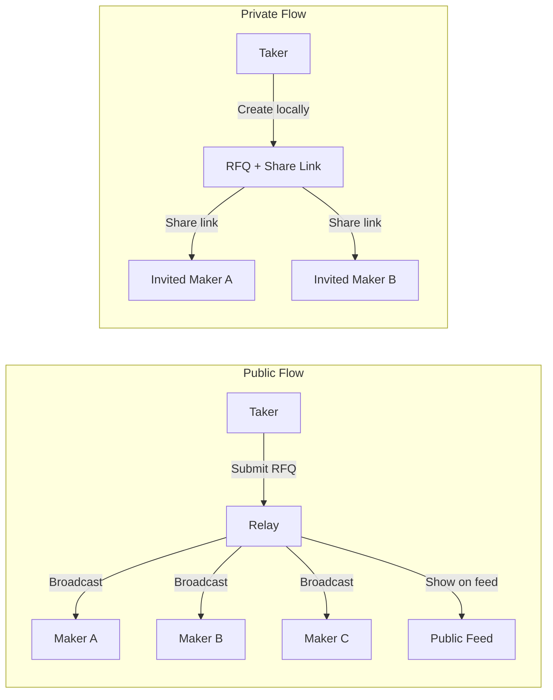

# Public vs Private RFQs

import { Callout } from 'nextra/components'

When creating an RFQ, you choose its visibility: **public** or **private**. This controls who sees your request and how it reaches makers. Both modes settle through the same on-chain contract with identical security guarantees.

## Who This Is For

- **Takers** deciding whether to broadcast their RFQ or route it privately.
- **Large traders** (above $50k) evaluating the privacy vs competition trade-off.
- **OTC desks** looking for discreet, bilateral execution with on-chain settlement.

The diagram below shows how public and private RFQs take different paths from creation to quote delivery.



## Public RFQs

Public RFQs are broadcast to every maker connected to the WebSocket relay. They also appear on the live RFQ feed, visible to all users of the platform.

**How it works:**

1. Your RFQ request is sent to the relay server via WebSocket.
2. The relay broadcasts the request to all subscribed makers (role: `maker`).
3. The RFQ appears on the public feed at `/swap` for any visitor to observe.
4. Any maker can submit a competing quote in response.

**Pros:**
- Maximum competition between makers, which typically produces the best price.
- No extra steps — submit and wait for quotes to arrive.
- Recommended for most trades.

**Cons:**
- Your trade intent is visible to all market participants.
- For large trades, visibility can cause adverse price movement on other venues before you execute (information leakage).

<Callout>
  Public is the default and recommended visibility for most trades. The competition from multiple makers usually outweighs the information leakage risk.
</Callout>

## Private RFQs

Private RFQs are **not** broadcast to the relay. The request stays entirely client-side until you explicitly share it with chosen makers.

**How it works:**

1. A `requestId` is created locally (UUID v4) without sending anything to the relay.
2. The UI generates a shareable RFQ JSON payload and a private share link (with a unique `shareToken`).
3. You distribute the share link or JSON to specific makers through any channel — direct message, Telegram, email, or the `allowedMakers` field for programmatic routing.
4. Only makers who receive the link can view the RFQ details and submit quotes.
5. Quotes are imported back into the UI via the JSON exchange panel or the share token endpoint.

**Pros:**
- Complete privacy — no public visibility of your trade intent.
- Reduces information leakage for large or sensitive trades.
- You control exactly which makers participate.
- Eligible for the privacy points multiplier on qualifying fills.

**Cons:**
- Fewer competing makers may result in wider spreads.
- Manual sharing adds friction compared to the automatic relay broadcast.
- Requires that you already have relationships with makers.

## Allowed Makers

For private RFQs, the `allowedMakers` field is an optional list of Ethereum addresses. When set, the share token endpoint will only accept quotes from makers whose address is in this list. This adds a second layer of access control beyond the share link itself.

```json
{
  "visibility": "private",
  "allowedMakers": [
    "0xABCD...1111",
    "0xEFGH...2222"
  ]
}
```

If `allowedMakers` is empty or omitted, any maker with the share link can respond.

## Intra-Taker Mode (Self-Quote)

A special case of private RFQs is **intra-taker mode**, where the taker and maker are the same entity. This is useful for:

- OTC desks executing internal crosses.
- Market makers rebalancing their own inventory through the protocol.
- Testing the RFQ pipeline end-to-end in development.

<Callout type="warning">
  Self-trades (where `maker === taker`) receive **zero points**. The points engine includes a self-trade guard that sets the multiplier to 0.0 for any fill where the maker and taker addresses match.
</Callout>

## Privacy Benefits for Large Trades

For trades above approximately $100,000 USD notional, the UI displays a **whale nudge** suggesting private mode. The rationale:

- Large public RFQs signal significant demand to the broader market.
- Other participants may front-run your trade by adjusting prices on AMMs or order books.
- Private routing to trusted makers avoids this information leakage entirely.

## Points Multiplier for Private Fills

Private fills that meet the notional threshold receive a **1.10x points multiplier** (10% bonus). The requirements:

| Condition | Value |
|-----------|-------|
| RFQ visibility | Private |
| Fill notional | \>= $50,000 USD |
| Multiplier (points context) | 1.10x |
| Multiplier (league score context) | 1.05x |

The privacy multiplier stacks with other multipliers (improvement, repeat decay, NFT boost) and is subject to the global multiplier floor (0.5x) and cap (3.0x).

If the benchmark is unavailable for a private fill, a 0.9x penalty multiplier is applied instead of the standard 1.0x, to discourage fills that cannot be verified against market benchmarks.

## Choosing Between Public and Private

| Factor | Public | Private |
|--------|--------|---------|
| Best for sizes | Any size, especially \< $100k | \> $100k or sensitive trades |
| Maker competition | Maximum | Limited to invited makers |
| Information leakage | High (visible to all) | None (only invited makers see it) |
| Setup effort | One click | Requires sharing link/JSON |
| Points bonus | None | 1.10x on fills \>= $50k |
| Feed visibility | Appears on live feed | Hidden from feed |

## Active RFQ Limits

The per-wallet limits differ by visibility:

| Visibility | Max Active RFQs |
|------------|----------------|
| Public | 3 |
| Private | 5 |

Private RFQs have a higher limit because they do not consume relay bandwidth and are less likely to be used for spam.

## Edge Cases and Failure Scenarios

| Scenario | What happens |
|----------|-------------|
| You share a private RFQ link but no maker responds | The RFQ expires after the TTL. No gas is spent. Share with additional makers or switch to public. |
| A maker not in `allowedMakers` tries to submit a quote | The share token endpoint rejects the quote. Only whitelisted addresses can respond. |
| You set `allowedMakers` to a single address and that maker is offline | You receive zero quotes. Consider adding multiple makers or using public mode. |
| Self-trade is detected (maker === taker) | The trade settles normally, but receives 0 points and 0 league score. |
| Private RFQ share link is leaked to unintended parties | Anyone with the link can submit quotes (unless `allowedMakers` restricts it). Use `allowedMakers` for sensitive trades. |
| Whale nudge appears but you choose public anyway | The RFQ proceeds normally. The nudge is advisory only. |

## Related Pages

- [Requesting a Quote](/trading/requesting-a-quote) — Full RFQ parameter reference
- [Your First Trade](/getting-started/your-first-trade) — Step-by-step walkthrough
- [Points Overview](/points/points-overview) — How fills earn points and multipliers
- [League Overview](/league/league-overview) — Competitive ranking and scoring
- [Venue Comparison Engine](/trading/venue-comparison-engine) — Benchmark pricing for all RFQs
