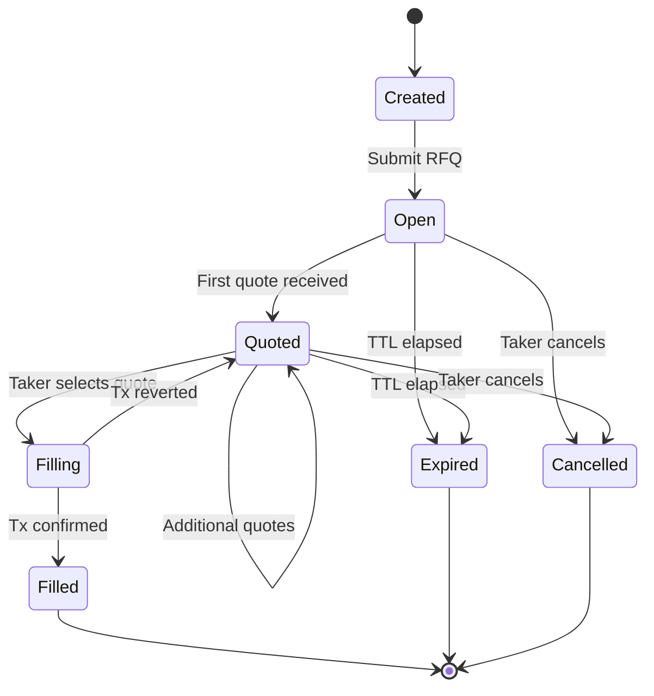

# RFQ Lifecycle

import { Callout } from 'nextra/components'

Every RFQ follows a deterministic state machine from creation to terminal state. Understanding this lifecycle helps you anticipate how your request will progress and when action is required.

## State Machine

An RFQ moves through the following states. Each transition is deterministic — the state can only move forward, never backward.

### State Definitions

| State | Internal Status | Description |
|-------|----------------|-------------|
| **Created** | -- | The RFQ parameters have been assembled on the client, but not yet submitted. |
| **Open** | `OPEN` | The RFQ is active. For public RFQs, it has been broadcast to the relay. The TTL countdown is running. Makers can submit quotes. |
| **Quoted** | `QUOTED` | At least one maker has submitted a quote for this RFQ. The RFQ remains open and additional quotes can still arrive until expiry. |
| **Filling** | -- | The taker has selected a quote and submitted the fill transaction. The transaction is pending confirmation on HyperEVM. |
| **Filled** | `FILLED` | The fill transaction has been confirmed on-chain. The trade is complete. This is a terminal state. |
| **Expired** | `EXPIRED` | The TTL elapsed without a fill. All quotes for this RFQ are no longer valid. This is a terminal state. |
| **Cancelled** | `KILLED` | The taker explicitly cancelled the RFQ before it expired. This is a terminal state. |

## Detailed Flow

### 1. Creation

When you click "Request Quote" in the UI:

1. A UUID v4 `requestId` is generated.
2. The RFQ parameters are validated (token pair, amount, TTL bounds).
3. The registry checks your active RFQ count against the per-wallet limits (3 public, 5 private).
4. The registry checks the rate limit (10 requests per minute per wallet+IP).
5. If all checks pass, the RFQ is registered in the server-side registry and a `shareToken` is generated for private sharing.
6. A `rfq.created` feed event is emitted.

### 2. TTL Countdown

The TTL begins counting down from the moment the RFQ is registered. The `expiry` field is set to `createdAt + ttlSeconds` (Unix timestamp).

The server runs an **expiry scanner** every 5 seconds that checks all active RFQs. When an RFQ's expiry time has passed:

1. Its status transitions to `EXPIRED`.
2. A `rfq.expired` feed event is emitted.
3. The entry is removed from the active RFQ store.
4. The wallet's active slot is freed.

<Callout>
  TTL values range from 10 seconds to 86,400 seconds (24 hours). The default is 60 seconds. Shorter TTLs create urgency for makers and are appropriate for volatile pairs.
</Callout>

### 3. Quote Accumulation Window

While the RFQ is `OPEN`, makers submit quotes via:

- **WebSocket relay** (public RFQs) -- quotes arrive in real-time.
- **JSON import / share link** (private RFQs) -- quotes are submitted through the API.

Each incoming quote triggers:

1. The registry transitions the RFQ to `QUOTED` status (if not already).
2. The quote is stored in the quote store, keyed by `requestId`.
3. A `rfq.quoted` feed event is emitted.
4. The quote is pushed to the taker's UI via the relay or SSE stream.

Multiple makers can quote simultaneously. The UI displays all quotes sorted by best price and validates each one independently.

### 4. Fill Execution

When the taker selects a quote and submits the fill transaction:

1. The RFQ transitions to `filling` (client-side state).
2. The on-chain settlement contract verifies the quote signature, expiry, and nonce.
3. Tokens are transferred atomically.
4. Upon confirmation, the registry transitions the RFQ to `FILLED`.
5. A `rfq.filled` feed event is emitted with the `fillTxHash`.

### 5. Cancellation

The taker can cancel an active RFQ at any time before it is filled:

1. A `CANCEL_REQUEST` message is sent to the relay (for public RFQs).
2. The registry transitions the RFQ to `KILLED`.
3. A `rfq.cancelled` feed event is emitted.
4. The wallet's active slot is freed immediately.
5. All pending quotes for this RFQ become invalid.

<Callout type="info">
  Cancellation is a client-side action only -- it is not an on-chain transaction. The relay simply stops forwarding quotes for the cancelled `requestId`. However, any quote that was already signed remains technically valid on-chain until its own expiry. In practice, the taker simply does not submit a fill transaction.
</Callout>

## Feed Events

The RFQ registry emits structured events at every state transition. These events power the live feed UI and Telegram notifications:

| Event | Trigger | Payload |
|-------|---------|---------|
| `rfq.created` | RFQ registered | Full RFQ data |
| `rfq.quoted` | New quote received | RFQ data + quote count |
| `rfq.filled` | Fill confirmed | RFQ data + `fillTxHash` |
| `rfq.cancelled` | Taker cancelled | RFQ data |
| `rfq.expired` | TTL elapsed | RFQ data |

Events are distributed via Server-Sent Events (SSE) to the feed stream at `/api/v1/feed/stream` and via Telegram notifications for significant events (created, filled, expired).

## On-Chain Finality

The fill transaction is the only on-chain step in the lifecycle. Once the fill is included in a HyperEVM block and the block reaches finality, the trade is irreversible. There is no concept of a "pending" or "disputable" fill -- the atomic settlement contract ensures both legs of the swap complete or neither does.

Nonce management prevents replay: each maker nonce can only be used once. After a successful fill, the nonce is consumed on-chain, making it impossible for the same quote to be filled again.
