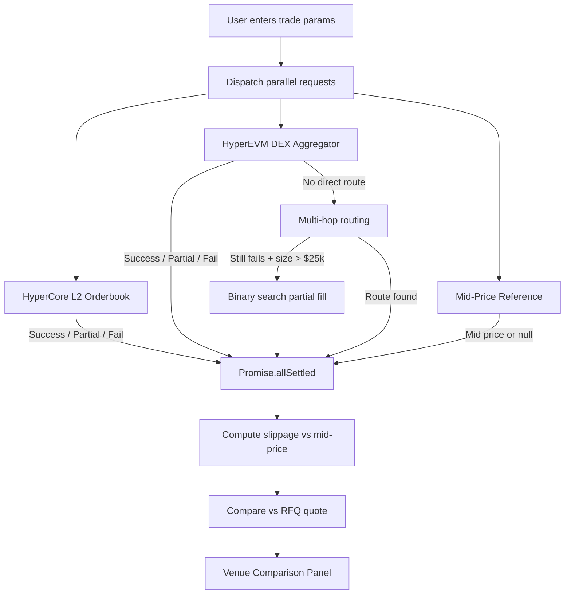

# How Venue Comparison Works

import { Callout } from 'nextra/components'

HyperQuote automatically compares execution across three independent venues for every swap request. This page explains the technical architecture behind the venue comparison engine.

## Three Venues

Every time a taker enters a trade, the UI fetches price estimates from three sources in parallel:

| Venue | Source | Method |
|-------|--------|--------|
| **HyperCore Spot** | Hyperliquid L2 orderbook | Orderbook walk simulation via VWAP |
| **HyperEVM DEX** | HT.xyz aggregator | Aggregator API proxy with multi-hop fallback |
| **RFQ** | Competing makers | Signed quotes via WebSocket relay |

The first two venues (HyperCore and DEX) serve as benchmarks. The RFQ quote from makers is compared against them so takers can verify they are getting competitive pricing.

The diagram below shows how all three venue estimates are fetched in parallel and combined into a single comparison result.



## Parallel Estimation with `Promise.allSettled`

All three venue estimates are dispatched simultaneously using `Promise.allSettled`. This ensures that a slow or failing venue does not block results from the others.

```ts
const [hlSettled, dexSettled, midSettled] = await Promise.allSettled([
  withRetry(() => estimateHypercoreRich(tokenIn, tokenOut, amountIn), signal),
  withRetry(() => fetchHtxyzQuote(tokenIn, tokenOut, amountIn, signal), signal),
  getMidPriceRef(tokenIn, tokenOut, amountIn, amountOut).catch(() => null),
]);
```

Each venue result is processed independently after the parallel fetch completes. A venue can succeed, partially fill, or fail without affecting the others.

## AbortSignal Cancellation

Every estimation call accepts an optional `AbortSignal`. When the user changes the input amount, switches tokens, or navigates away, the signal fires and all in-flight requests are cancelled immediately.

```ts
if (signal?.aborted) {
  const aborted: VenueFailure = {
    ok: false, reason: "aborted", routeLabel: fallbackRoute
  };
  return { hypercore: aborted, dex: aborted, midRef: null, timingMs: 0 };
}
```

This prevents stale results from overwriting fresh estimates in the UI.

## Retry with Jitter

Each venue call is wrapped in a `withRetry` helper that retries once on transient failures (network errors, 5xx responses). The retry delay is randomized between 200ms and 500ms to avoid thundering-herd effects.

```ts
async function withRetry<T>(fn: () => Promise<T>, signal?: AbortSignal): Promise<T> {
  try {
    return await fn();
  } catch (err) {
    if (signal?.aborted) throw err;
    if (!isTransient(err)) throw err;
    const jitter = 200 + Math.random() * 300;
    await new Promise((r) => setTimeout(r, jitter));
    if (signal?.aborted) throw new DOMException("Aborted", "AbortError");
    return fn();
  }
}
```

<Callout type="info">
Only transient errors trigger a retry. `AbortError` exceptions, structural failures (no market), and unsupported pairs fail immediately without retry.
</Callout>

## Structured Result Types

Every venue returns one of three discriminated union types. There is never a bare `null` or an ambiguous "Unavailable" string in the result.

### `VenueSuccess`

The venue can fully fill the requested amount.

```ts
interface VenueSuccess {
  ok: true;
  estimate: AMMEstimate;
  routeLabel: string;          // e.g. "USDC -> PURR"
  slippageVsMid: number | null; // % impact vs mid-price benchmark
}
```

### `VenuePartial`

The venue can fill some but not all of the requested amount.

```ts
interface VenuePartial {
  ok: "partial";
  filledPct: number;           // 0.0-1.0
  filledIn: bigint;            // amount of tokenIn consumed
  filledOut: bigint;           // amount of tokenOut received
  remainingIn: bigint;         // unfilled tokenIn
  avgPrice: number;            // VWAP for the filled portion
  slippagePct: number;
  slippageVsMid: number | null;
  routeLabel: string;
  reason: "insufficient_liquidity";
}
```

### `VenueFailure`

The venue cannot provide any quote for this pair.

```ts
interface VenueFailure {
  ok: false;
  reason: VenueFailureReason;  // structured reason code
  routeLabel: string;
}
```

Failure reasons include `no_hl_market`, `transient_failure`, `unsupported_pair`, `no_dex_route`, and `aborted`. Each reason maps to a human-readable explanation in the UI.

## Combined Result

The `estimateVenues` function returns a combined result containing all three venue outcomes plus timing information:

```ts
interface VenueComparisonResult {
  hypercore: VenueResult;
  dex: VenueResult;
  midRef: MidPriceRef | null;
  timingMs: number;  // wall-clock time for the entire parallel fetch
}
```

The `midRef` contains the HyperCore orderbook mid-price reference used as the universal benchmark for computing slippage across all venues.

## Fallback Sequence for DEX

When the direct HT.xyz quote returns null, the system attempts two fallback strategies before reporting failure:

1. **Multi-hop routing** -- Try routing through liquid intermediates (USDC, wHYPE, USDT0)
2. **Binary search for partial fill** -- For trades over $25k, search for the largest fillable amount

Only if both fallbacks also return null does the DEX venue report `no_dex_route`.

## Timing and Dev Logging

In development mode, each venue result is logged with structured metadata including venue name, result status, route label, token pair, exact type, and timing in milliseconds. This makes it straightforward to diagnose slow venues or unexpected failures during development.
